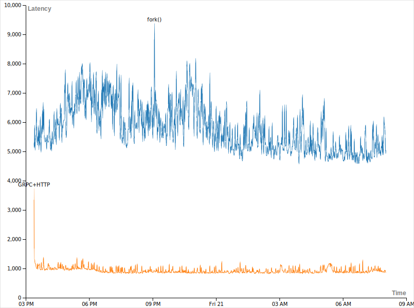

### grpc vs fork() 비교 

### 기존 fork() 방식
- 평균값 5773.38us
- 최대값 8705us
- 최소값 4721us
- 변동폭 3984us

### grpc + http

- 평균값 929.1us `x6.21`
- 최대값 1388us: 최초 연결시에 3729us
- 최소값 820us
- 변동폭 568us `x7.01` 

>  - 최초 연결시 초기 스파이크가 존재합니다.
